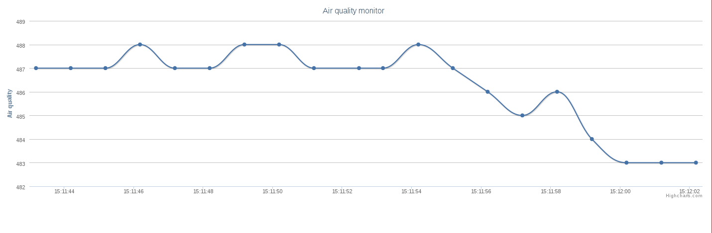

# Summary 

The scripts bring the possibility to record (python daemon), print remotely (html/js+highcharts+ajax) and share (upnp service, brisa) the air quality mesured by the sensor.

Licence : GPL v2+

Author : Thibault Duponchelle

